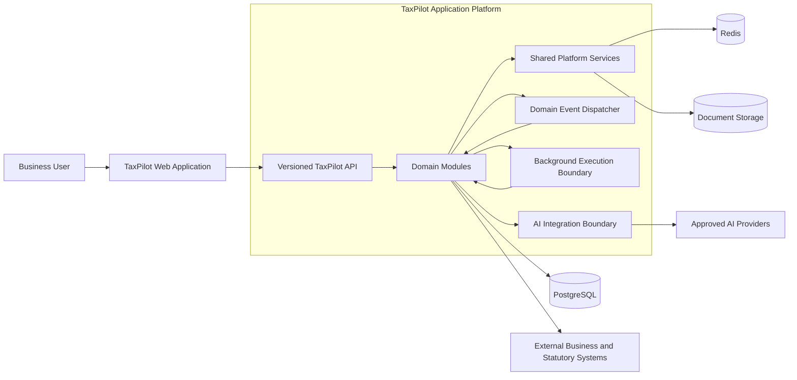
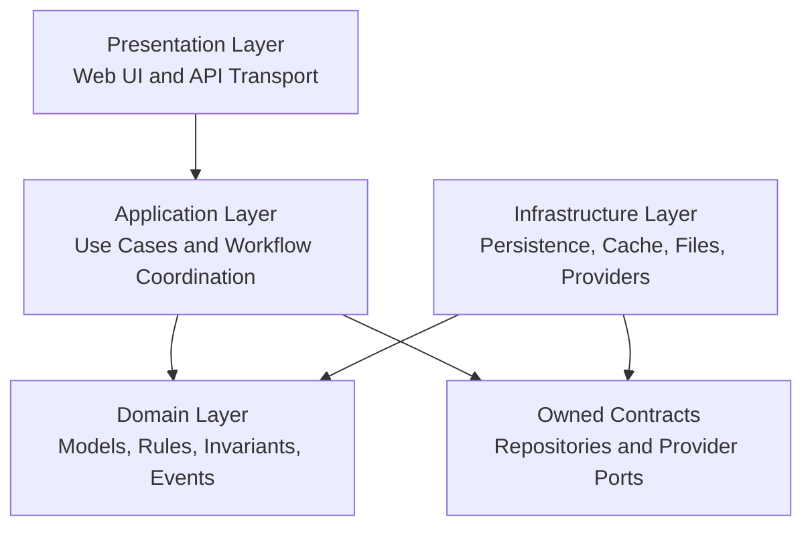
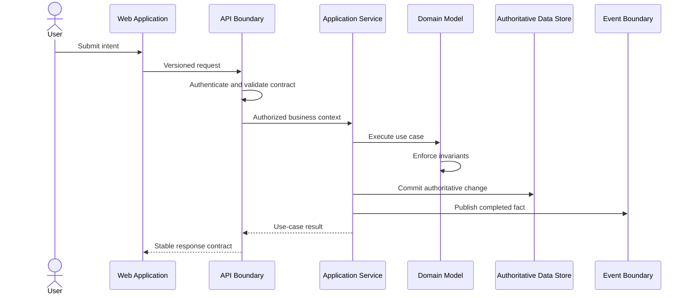
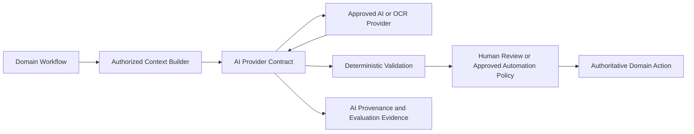
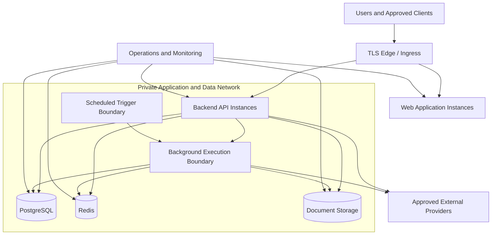

# TaxPilot Platform Architecture

| Field | Value |
|---|---|
| Version | 1.0.0 |
| Status | Approved |
| Owner | TaxPilot Architecture Governance |
| Effective date | 2026-07-26 |

## Purpose

This document defines the technical organization of the TaxPilot platform. It
establishes the approved architectural style, layers, runtime boundaries,
platform services, integration patterns, data flows, security zones, deployment
model, technology baseline, and architectural constraints.

## Scope

This document applies to the TaxPilot web application, backend application,
business modules, shared platform capabilities, data services, AI integrations,
external integrations, and deployment environments.

It does not define detailed domain ownership, business rules, source-code
conventions, endpoint schemas, infrastructure sizing, or delivery procedures.
Those concerns belong respectively in the Domain Architecture, Business
Workflow Specifications, Coding Standards, Engineering Specifications, and
operational documentation.

## Audience

This document is intended for architects, engineers, security practitioners,
operators, technical reviewers, and AI coding agents designing or changing the
TaxPilot platform.

## Table of Contents

1. [Normative Language](#1-normative-language)
2. [Platform Overview](#2-platform-overview)
3. [Architectural Style](#3-architectural-style)
4. [Layered Architecture](#4-layered-architecture)
5. [Domain Architecture Overview](#5-domain-architecture-overview)
6. [Shared Platform Services](#6-shared-platform-services)
7. [Cross-Cutting Concerns](#7-cross-cutting-concerns)
8. [Event-Driven Communication](#8-event-driven-communication)
9. [Background, Scheduled, and Long-Running Processing](#9-background-scheduled-and-long-running-processing)
10. [Data Flow Principles](#10-data-flow-principles)
11. [AI Integration Architecture](#11-ai-integration-architecture)
12. [Security Architecture](#12-security-architecture)
13. [Deployment Architecture](#13-deployment-architecture)
14. [Technology Stack](#14-technology-stack)
15. [Architectural Constraints](#15-architectural-constraints)
16. [References](#16-references)
17. [Version History](#17-version-history)

## 1. Normative Language

The terms **MUST**, **MUST NOT**, **SHALL**, **SHALL NOT**, **SHOULD**, **SHOULD
NOT**, and **MAY** have the meanings established by the [TaxPilot Architecture
Constitution](TaxPilot-Constitution-v1.0.md#1-normative-language).

Constitutional terms, including Material Business Fact, Material Workflow,
Consequential Business Action, Critical Operation, and Trusted Platform
Authority, retain their constitutional definitions.

## 2. Platform Overview

TaxPilot is organized as a browser-based business application backed by a
domain-modular application platform. The platform coordinates business
capabilities while preserving a single authoritative owner for each business
fact and lifecycle.

The approved baseline consists of:

- a web presentation application;
- a versioned backend API;
- a modular backend application containing independently owned business
  modules;
- shared platform capabilities used through stable contracts;
- logical background and scheduled execution boundaries for work outside the
  request lifecycle;
- PostgreSQL as the transactional system of record;
- Redis for non-authoritative transient state and coordination;
- controlled document storage and extraction capabilities;
- in-process domain event dispatch within the modular application boundary; and
- provider boundaries for AI and external systems.

Arrows represent permitted communication paths, not ownership. Domain ownership
is defined in the [Domain Architecture](Domain-Architecture.md).

## 3. Architectural Style

### 3.1 Modular monolith baseline

The backend SHALL operate as a modular monolith unless an accepted ADR approves
a different runtime boundary. Business modules share an application deployment
and transactional database platform while retaining explicit logical ownership,
contracts, and dependency boundaries.

The modular monolith is the default because it supports transactional integrity
and operational simplicity without preventing future extraction. Shared runtime
deployment MUST NOT be interpreted as shared domain ownership.

### 3.2 Domain-driven modularity

Business capabilities SHALL be organized into bounded modules aligned with the
Domain Architecture. Each module MUST encapsulate its domain model, application
behavior, persistence access, and published contracts. A module MUST NOT mutate
another module's owned records through direct persistence access.

### 3.3 Contract-based integration

Module-to-module and system-to-system interaction MUST occur through an owned
application contract, API contract, or domain event. Consumers MUST NOT depend
on another module's internal classes, tables, or undocumented behavior.

### 3.4 Evolution toward distributed deployment

A module MAY be extracted into an independently deployed service when justified
by an accepted ADR. Extraction MUST preserve domain ownership and published
semantics and MUST define consistency, event delivery, security, observability,
migration, and operational ownership.

Distribution is not a default objective. Scale alone does not require service
extraction when the modular application can scale safely as a unit.

### 3.5 Synchronous and asynchronous interaction

Synchronous calls SHOULD be used when the caller requires an immediate
authoritative response to complete its operation. Domain events SHOULD be used
to notify other modules of completed facts and to initiate independently owned
downstream work.

A synchronous dependency MUST NOT create circular domain ownership. An
asynchronous workflow MUST expose incomplete or failed downstream outcomes when
those outcomes are relevant to users or compliance.

## 4. Layered Architecture

TaxPilot uses a layered architecture inside each backend module. The layers
define responsibility and dependency direction; they do not require identical
folder structures in every module.

### 4.1 Presentation layer

The presentation layer exposes user and machine interfaces. It SHALL translate
transport input into application requests, establish authenticated business
context, and translate application outcomes into stable response contracts.

The presentation layer MUST NOT own business rules, authoritative financial
calculations, or domain lifecycle transitions.

### 4.2 Application layer

The application layer coordinates use cases, authorization context,
transactional boundaries, domain objects, repository contracts, and event
publication. It MAY coordinate multiple capabilities but MUST NOT redefine the
invariants owned by a domain.

### 4.3 Domain layer

The domain layer owns business concepts, invariants, state transitions, domain
services, and domain events. It MUST remain independent of presentation and
provider-specific concerns.

Detailed rules belong in approved Business Workflow Specifications. The domain
layer is their authoritative implementation location, not their documentation
substitute.

### 4.4 Infrastructure layer

The infrastructure layer implements owned contracts for persistence, caching,
file storage, messaging, AI providers, and external systems. Provider-specific
behavior MUST remain behind the contract owned by the consuming platform or
domain capability.

### 4.5 Web application layers

The web application SHALL separate route composition, user-interface components,
feature-level application state, validation, and API access. Browser state is a
user-experience projection and MUST NOT become authoritative for permissions,
financial calculations, or domain state.

## 5. Domain Architecture Overview

The platform is decomposed by business capability. This section identifies the
technical module landscape; authoritative bounded-context definitions and
ownership belong in the [Domain Architecture](Domain-Architecture.md).

| Capability area | Platform responsibility | Current technical status |
|---|---|---|
| Identity | User identity, credentials, sessions, roles, and permissions | Backend module |
| Business | Business identity, membership, settings, and tax profile context | Backend module |
| Catalog | Canonical commercial and tax identity of products and services | Backend module |
| Sales | Customers, sales invoices, and sales lifecycle | Backend module |
| Payments | Receipts, payment allocation, and payment lifecycle | Independent capability boundary; legacy APIs are temporarily co-located in the Sales module |
| Purchases | Suppliers and purchase invoices | Backend module |
| Expenses | Vendors and expense records | Backend module |
| Inventory | Products with inventory capability, warehouses, balances, and movements | Backend module |
| Accounting | Chart of accounts, journal, balances, trial balance, and financial statements | Backend module |
| GST | GST registration, tax classification, and tax calculation | Backend module |
| Compliance | Statutory reporting, filing lifecycle, e-invoicing, and related regulatory workflows | Independent capability boundary; currently co-located within the GST module |
| Documents | Document lifecycle, extraction, review, and workflow automation | Backend module |
| Banking | Bank connectivity, imported transactions, matching, and reconciliation | Planned domain boundary |
| Reporting | Cross-domain operational and financial projections | Planned domain boundary |
| Intelligence | Advisory insights and AI-assisted business interpretation | Capability boundary; initially embedded behind domain-owned contracts |

The table distinguishes bounded capability ownership from current code
placement. Co-location MUST NOT transfer ownership to the containing module.
Temporary placement MUST expose an owned contract, identify the intended
capability boundary, and define a migration condition in the Domain Architecture
or an accepted ADR. The current absence of a standalone module does not permit
another module to claim a planned or independent capability.

## 6. Shared Platform Services

Shared platform services provide technical capabilities that are not business
systems of record. They MUST expose stable contracts, maintain explicit owners,
and avoid embedding domain-specific policy.

| Service | Responsibility | Boundary |
|---|---|---|
| Configuration | Environment-specific runtime configuration and feature configuration | MUST NOT contain mutable business rules that require domain history |
| Database platform | Connection management, transaction support, and schema migration infrastructure | Domain data remains owned by its module |
| Cache and coordination | Transient acceleration, short-lived state, and coordination | Redis or any successor MUST NOT become the sole authority for a Material Business Fact |
| Event dispatch | Registration and delivery of domain events inside the application boundary | Event meaning remains owned by the publishing domain |
| Background execution | Execution of authorized asynchronous and scheduled work | Work ownership remains with the initiating domain; execution infrastructure MUST NOT own business policy |
| Document storage | Controlled storage and retrieval of source documents and derived artifacts | Document ownership, retention, and access remain governed by the Documents domain and security policy |
| Provider integration | Adapters for AI, OCR, statutory, banking, communication, and other external providers | Provider contracts MUST be owned by the consuming capability |
| API framework | Routing, response envelopes, dependency composition, and exception translation | MUST remain free of domain policy |
| Operational telemetry | Platform health, diagnostic evidence, and workflow correlation | MUST preserve tenant context and data-minimization constraints |
| Time and identifiers | Consistent platform time and identity generation abstractions where required | Domain semantics and externally assigned identifiers remain domain decisions |

Identity and Business are foundational domains, not generic shared utilities.
Their capabilities MAY be consumed platform-wide only through their published
contracts.

## 7. Cross-Cutting Concerns

Cross-cutting behavior SHALL be implemented through common platform contracts or
consistent policies without bypassing domain ownership.

### 7.1 Business context and tenant isolation

Every operation on business-owned data MUST carry an authenticated and
authorized business context. Tenant isolation MUST apply consistently to API
access, application services, persistence queries, events, cached data,
documents, background processing, telemetry, and external integrations.

### 7.2 Validation

Validation SHALL occur at the appropriate boundary:

- transport validation establishes contract shape and basic constraints;
- application validation establishes use-case preconditions; and
- domain validation enforces business invariants.

Downstream layers MUST NOT assume that earlier validation replaces their owned
invariants.

### 7.3 Error semantics

Expected domain and application failures MUST remain distinguishable from
unexpected platform failures. External error contracts MUST be stable and safe
to disclose. Internal diagnostic evidence MUST remain correlated without
exposing secrets or unnecessary sensitive data.

### 7.4 Transactions and consistency

Each Material Workflow MUST declare its consistency boundary. Operations within
one domain SHOULD use a single authoritative transaction when their invariants
must succeed or fail together. Cross-domain outcomes that cannot share that
boundary MUST be explicit, observable, and reconcilable.

### 7.5 Observability

Critical Operations and Consequential Business Actions MUST produce sufficient
operational and audit evidence to establish initiator, business context,
operation, outcome, and correlation. Technical telemetry and business audit
records are distinct concerns and MUST have separate access and retention
policies.

### 7.6 Configuration and secrets

Runtime configuration MUST be externalized from deployable artifacts. Secrets
MUST be supplied through an approved protected mechanism and MUST NOT be stored
in source control or client-delivered configuration.

### 7.7 Time, currency, and statutory context

Time-dependent business behavior MUST use an explicit effective context.
Financial data MUST preserve currency, precision, and rounding context. Tax and
statutory behavior MUST preserve the rule version or effective basis necessary
to reproduce an outcome.

## 8. Event-Driven Communication

### 8.1 Event roles

TaxPilot distinguishes:

| Event type | Purpose | Authority |
|---|---|---|
| Domain event | Records a completed fact within a domain | Publishing domain |
| Integration event | Communicates a stable fact across a runtime or external boundary | Contract owner |
| Operational signal | Reports technical health or processing state | Platform operations |

An event MUST carry stable identity and occurrence context and represent a fact
rather than an instruction to modify another domain's records.

### 8.2 Current delivery boundary

The current backend uses in-process domain event dispatch. This mechanism is
valid only within the modular application runtime and does not provide a durable
cross-process delivery guarantee.

In-process delivery MAY be used only when loss during process failure is
acceptable or the outcome can be reconstructed from authoritative state. It
MUST NOT be the sole delivery mechanism for a required statutory, financial, or
external effect.

Workflows that require guaranteed recovery, independent scaling, or external
subscribers MUST use a durable integration-event boundary introduced through an
accepted ADR and Engineering Specification. Domain event semantics MUST remain
stable when delivery transport changes.

### 8.3 Transactional relationship

The domain MAY raise a domain event while processing a business operation, but
the event MUST NOT be delivered to subscribers as a completed fact until the
authoritative transaction commits. If the transaction fails, its pending events
MUST be discarded.

Work that must participate in the same transaction is application coordination,
not post-commit event consumption. Integration events MUST be derived from a
committed fact and published through a recoverable boundary when their delivery
is required.

Where a business transaction and durable event publication cannot be atomic,
the design MUST provide recoverable publication and protection against lost or
duplicate business effects. The selected mechanism belongs in the relevant
Engineering Specification or ADR.

### 8.4 Consumer responsibilities

Consumers MUST treat published events as immutable facts, validate contract
versions, preserve tenant context, and avoid mutating the publisher's owned
records.

Post-commit consumer failure MUST NOT roll back or invalidate the publisher's
committed fact. Delivery infrastructure MUST isolate unrelated subscribers from
one another. The current in-process dispatcher MUST NOT be used for multiple
required outcomes unless it provides that isolation; required recoverable
outcomes MUST use the durable boundary defined in Section 8.2.

Event contracts MUST define compatibility and retirement policy before use
outside their original module.

## 9. Background, Scheduled, and Long-Running Processing

### 9.1 Execution classes

TaxPilot distinguishes three logical execution classes:

| Class | Boundary | Appropriate use |
|---|---|---|
| Request-bound | Completes within the initiating API operation | Work required to produce the immediate authoritative response |
| Background | Executes outside the initiating request after an accepted trigger | Asynchronous extraction, integration, projection, notification, or other independently recoverable work |
| Scheduled | Begins from an approved time or calendar trigger | Periodic compliance, synchronization, reconciliation, maintenance, or reporting work |

Long-running work MUST use the background or scheduled boundary. It MUST NOT
depend on the continued availability of a user request or a single API process.

### 9.2 Responsibility boundaries

The initiating domain owns the business purpose, authorization requirements,
inputs, invariants, and interpretation of the outcome. Shared execution
infrastructure owns dispatch, execution coordination, workload status, and
operational evidence. It MUST NOT make domain decisions or become the authority
for the resulting Material Business Fact.

A scheduled trigger initiates an owned application use case. It MUST NOT bypass
the same authorization policy, domain validation, or tenant isolation that
applies to an equivalent user-initiated operation.

### 9.3 Work identity and state

Background and scheduled work that can affect a Material Business Fact MUST have
a stable work identity, authorized business context, owning capability, trigger
provenance, and visible processing outcome. Its state MUST survive replacement
of an application or execution process when recovery is required.

Authoritative business results remain in the owning domain. Execution status is
operational state and MUST NOT be presented as a completed business outcome
until the owning domain commits that outcome.

### 9.4 Delivery and recovery

Work whose loss would omit a required financial, statutory, security, or
external effect MUST be initiated through a recoverable boundary. Execution MAY
be repeated; the owning use case MUST protect against duplicate business effects
and reconcile uncertain outcomes.

In-process background execution MAY be used only for non-critical work that is
safe to lose or reconstruct. The choice of scheduler, worker runtime, transport,
and recovery mechanism belongs in an ADR and Engineering Specification.

### 9.5 Scaling and isolation

Background execution and scheduling are logical deployment boundaries distinct
from interactive API processing. They MAY share a deployable artifact with the
modular application, but MUST be independently separable when workload volume,
duration, security, or failure isolation requires it.

A failing or resource-intensive workload MUST NOT exhaust the capacity required
for Critical Operations. Concurrency, prioritization, and capacity policies
belong in environment-specific Engineering Specifications.

## 10. Data Flow Principles

### 10.1 Command flow

A state-changing request SHALL follow this logical flow:

The diagram is logical. It does not prescribe classes, calls, or transaction
implementation.

### 10.2 Query flow

Queries MAY use domain repositories, read models, or governed reporting
projections. A projection MUST identify its source domains, freshness, and
reconciliation behavior. It MUST NOT be represented as an authoritative source
when it is derived.

### 10.3 Cross-domain data use

A consumer SHOULD reference another domain's stable identifier and obtain
current authoritative data through a published contract. When a historical
record requires a durable snapshot, the owning BWS MUST identify the snapshot
fields and their effective meaning.

Shared database infrastructure MUST NOT justify cross-domain table access. A
domain MUST NOT read or mutate another domain's internal persistence, including
through direct joins.

Cross-domain reads MUST use an owner-published application contract, API,
projection, or stable read model. A database projection or read model is valid
only when the owning domain publishes its schema and lifecycle as a supported
contract; the consumer MUST NOT depend on the owner's underlying tables.

### 10.4 External ingress and egress

Data received from browsers, documents, banks, statutory systems, AI providers,
or other external sources is untrusted until authenticated where applicable,
validated, and accepted by the owning domain.

Outbound data MUST be authorized, minimized for its purpose, and traceable to
the initiating workflow. External acceptance MUST NOT be inferred solely from a
successful transport response when the provider has a separate processing
lifecycle.

### 10.5 Caching

Cached data is a disposable projection. Cache loss MUST NOT destroy a Material
Business Fact, and cache content MUST NOT bypass authorization or tenant
isolation. Freshness and invalidation expectations MUST be defined for every
business-sensitive cache use.

## 11. AI Integration Architecture

### 11.1 Architectural role

AI capabilities SHALL operate behind an application-owned integration boundary.
Domain modules supply authorized context and retain authority for validation,
state transitions, and committed records. Provider responses are untrusted
advisory or extracted data until accepted through deterministic domain rules.

### 11.2 Provider boundary

AI and OCR providers MUST be accessed through owned provider contracts. Domain
logic MUST NOT depend directly on a provider-specific model, response shape, or
SDK. Provider selection and replacement MUST preserve data classification,
availability, evaluation, and compatibility requirements.

### 11.3 Context construction

AI context MUST be assembled by the application for an approved purpose and
authorized business context. It MUST contain only the data required for that
purpose. Retrieved or generated context MUST retain enough provenance to support
review and diagnosis.

### 11.4 Output handling

AI output MUST be structurally validated before use. Financial calculations,
permissions, compliance decisions, and lifecycle transitions MUST be confirmed
by their Trusted Platform Authority. Low-confidence, invalid, or unavailable AI
output MUST follow a defined non-AI or human-review path.

### 11.5 AI evidence

For AI output that can affect a Consequential Business Action, the platform MUST
associate the output with the relevant input provenance, provider and model
identity, configuration version, evaluation context, and review outcome, subject
to data-retention and security requirements.

## 12. Security Architecture

### 12.1 Trust boundaries

The primary trust boundaries are:

1. the user device and browser;
2. the public API boundary;
3. the authenticated application boundary;
4. domain ownership boundaries;
5. the transactional data boundary;
6. document, cache, and telemetry stores; and
7. AI, statutory, banking, and other external providers.

Crossing a trust boundary MUST establish identity where applicable, validate
input, enforce authorization, minimize data exposure, and produce evidence
proportionate to risk.

### 12.2 Authentication and session boundary

The Identity domain is the Trusted Platform Authority for user authentication,
credentials, sessions, roles, and permission definitions. Authentication MUST be
enforced before protected application behavior is invoked. Client-held session
state MUST NOT be trusted without platform verification.

### 12.3 Authorization and business scope

Authorization MUST consider both user identity and active business context.
Domain modules remain responsible for enforcing permissions and ownership at
their trusted application boundary. Presentation-layer visibility is not an
authorization control.

### 12.4 Data protection zones

Transactional data, documents, caches, backups, telemetry, and AI context MUST be
classified and protected according to sensitivity. Data protection controls
MUST apply in transit, at rest, in exports, and across provider boundaries.

Production data MUST NOT be introduced into lower environments without an
approved, controlled, and appropriately protected process.

### 12.5 External provider security

Each external provider integration MUST define credentials, permissions, data
scope, network trust, failure behavior, audit evidence, and revocation. A
provider compromise or outage MUST be containable without surrendering domain
authority or tenant isolation.

### 12.6 Security controls by layer

| Layer | Required security responsibility |
|---|---|
| Web application | Safe session handling, output safety, and prevention of unintended data disclosure |
| API boundary | Authentication enforcement, request validation, rate and abuse controls where required, and safe response contracts |
| Application and domain | Business authorization, invariant enforcement, and audit initiation |
| Infrastructure | Protected connectivity, credential handling, encryption, isolation, backup, and recovery |
| Provider boundary | Data minimization, provider authorization, response validation, and revocation |

Detailed control selection belongs in Security Engineering Specifications and
operational standards.

## 13. Deployment Architecture

### 13.1 Logical topology

TaxPilot SHALL support separate web, API, transactional database, cache, document
storage, and external-provider deployment boundaries.

### 13.2 Environment separation

Development, testing, staging, and production SHALL be distinct runtime
environments. Production credentials and data MUST remain isolated from
non-production environments. Configuration SHALL be environment-specific while
deployable application artifacts SHOULD remain equivalent across promoted
environments.

### 13.3 Application scaling

Web and API instances SHOULD remain replaceable and horizontally scalable.
Authoritative state MUST reside in managed persistence boundaries rather than a
single application process. Any use of local process or local filesystem state
MUST define how availability, consistency, and replacement are preserved before
production use.

### 13.4 Data service deployment

PostgreSQL is the authoritative transactional persistence platform. Redis is a
non-authoritative transient service. Document storage is a durable data service
and MUST provide access control, retention, backup, and recovery appropriate to
document classification.

Data services MUST support monitored backup and tested recovery. Availability,
capacity, recovery objectives, topology, and provider selections belong in
environment-specific Engineering Specifications.

### 13.5 Network exposure

Only intended ingress surfaces MAY be publicly reachable. Transactional
databases, caches, internal document stores, and management interfaces MUST
remain on restricted network paths. Outbound provider access SHOULD be limited
to approved destinations and purposes.

### 13.6 Deployment evolution

Containerized deployment is the current portable application baseline. The
target hosting provider and orchestration platform are not constitutionally
fixed. Any production topology MUST preserve the logical boundaries and
constraints defined here.

## 14. Technology Stack

This section records the approved current technology baseline. Major replacements
or additions that alter architectural boundaries require an ADR. Patch and
compatible minor upgrades follow dependency and release governance rather than
an architecture amendment.

| Area | Approved baseline | Architectural role |
|---|---|---|
| Web framework | Next.js 15 with React 19 and TypeScript 5 | Browser application and route composition |
| Web data access | TanStack Query and Axios | Server-state coordination and API transport |
| Web validation | Zod and React Hook Form | Client contract and form validation; non-authoritative |
| Web presentation | Tailwind CSS, Radix UI primitives, and Recharts | Interface composition and visualization |
| Backend language | Python 3.12 | Backend application runtime |
| API framework | FastAPI | Versioned HTTP API and application composition |
| Contract validation | Pydantic 2 | API and configuration contracts |
| Persistence | SQLAlchemy 2 asynchronous ORM | Domain persistence adapters and transaction access |
| Schema migration | Alembic | Governed relational schema evolution |
| Transactional database | PostgreSQL 16 | Authoritative relational data store |
| Cache and coordination | Redis 7 | Non-authoritative transient state and coordination |
| Document processing | OCR provider boundary with Tesseract and EasyOCR support | Document text extraction |
| Packaging | uv for Python; npm for web dependencies | Reproducible dependency management |
| Application packaging | OCI-compatible containers | Portable runtime artifact |
| API contract description | OpenAPI generated from the API application | Machine-readable HTTP contract baseline |

Technology usage MUST conform to the boundaries in this document. Detailed
library conventions, supported versions, testing tools, and coding requirements
belong in the [Coding Standards](../engineering/Coding-Standards.md).

## 15. Architectural Constraints

The following constraints govern platform design:

| ID | Constraint |
|---|---|
| PA-01 | The approved Constitution is authoritative over this document. A conflict MUST be resolved in favor of the Constitution. |
| PA-02 | The backend SHALL remain a domain-modular application unless an accepted ADR approves extraction or another runtime style. |
| PA-03 | Each Material Business Fact MUST have one domain owner; shared infrastructure MUST NOT become a competing owner. |
| PA-04 | Modules MUST interact through owned contracts or events and MUST NOT mutate another module's persistence directly. |
| PA-05 | PostgreSQL SHALL remain the authoritative transactional store until an accepted ADR defines a replacement or a domain-specific alternative. |
| PA-06 | Redis and other caches MUST remain non-authoritative and disposable. |
| PA-07 | Browser state and client-supplied calculations MUST remain non-authoritative. |
| PA-08 | Cross-domain workflows MUST preserve tenant context, fact provenance, and visible incomplete outcomes. |
| PA-09 | In-process events MUST NOT be represented as durable cross-process delivery. Durable integration requires an approved transport design. |
| PA-10 | AI and external-provider output MUST pass through an owned provider boundary and deterministic domain validation before authoritative use. |
| PA-11 | Production application instances SHOULD be replaceable; authoritative state MUST NOT depend on one application process. |
| PA-12 | Public contract, domain ownership, persistence authority, or deployment-boundary changes require an ADR and, where implementation is material, an Engineering Specification. |
| PA-13 | Detailed business rules MUST remain in BWS documents; detailed implementation and operational choices MUST remain in Engineering Specifications or standards. |
| PA-14 | A domain MUST NOT access another domain's internal persistence; cross-domain reads MUST use an owner-published contract, projection, or stable read model. |
| PA-15 | Required background and scheduled outcomes MUST use a recoverable execution boundary and remain owned by the initiating domain. |

## 16. References

### Normative references

- [TaxPilot Architecture Constitution v1.0](TaxPilot-Constitution-v1.0.md)
- [Domain Architecture](Domain-Architecture.md)
- [Engineering Charter](../engineering/Engineering-Charter.md)
- [Coding Standards](../engineering/Coding-Standards.md)

Normative references that are not yet approved are informative until approved
under the governance rules established by the Constitution.

### Accepted architecture decisions

- [ADR-0015: Canonical catalog with optional capability profiles](../adr/0015-canonical-catalog-domain.md)
- [ADR-0016: Canonical Sales workflow with legacy compatibility](../adr/0016-canonical-sales-workflow.md)
- [ADR-0018: Canonical Sales Financial Rules Engine](../adr/0018-sales-financial-rules-engine.md)
- [ADR-0019: Advisory Sales Intelligence](../adr/0019-advisory-sales-intelligence.md)

## 17. Version History

| Version | Date | Status | Summary |
|---|---|---|---|
| 1.0.0 | 2026-07-26 | Approved | Initial TaxPilot Platform Architecture ratified and effective. |
