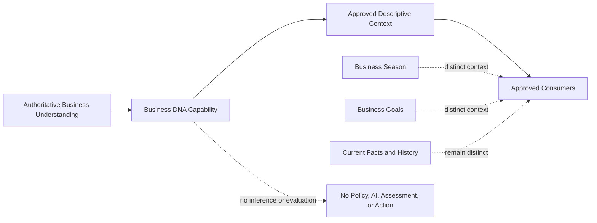

# ES-003 — Business DNA Capability

| Attribute | Value |
|---|---|
| Version | 1.0 |
| Status | Approved |
| Owner | Engineering |
| Last Updated | 2026-08-05 |
| Authority | KP-001 — Business DNA v1.0 |

## Capability Identity

Business DNA is the authoritative descriptive-context capability for TaxPilot. It owns the preservation and deterministic availability of enduring business understanding through the five canonical profiles.

It does not own Business Season, Business Goals, current deterministic facts, business history, Business Health, Business Momentum, Business Confidence, or any evaluative assessment. [Trace: KP-001 §§3, 6, 10, 13, 15, 19, 21]

## 1. Purpose
## 1. Purpose

This Engineering Specification translates KP-001 — Business DNA into an implementable capability boundary. It defines how TaxPilot preserves authoritative, descriptive business understanding for contextual relevance and explainability without inferring, calculating, evaluating, or redefining the business.

KP-001 remains the authority for the canonical definition, business meaning, rules, relationships, and future evolution of Business DNA. This specification does not alter or reinterpret those concepts.

## 2. Scope

The Business DNA capability shall:

- preserve an authoritative, evolving description of the business through the five canonical profiles;
- accept only approved business understanding and associated deterministic evidence or owner-provided context;
- expose Business DNA as enduring context for approved consumers;
- preserve the distinction between Business DNA, Business Season, Business Goals, current deterministic business facts, and history;
- preserve traceability and explicit limitations in available business understanding; and
- support deterministic explanation of available context, profile coverage, changes, and limitations.

Business DNA is descriptive rather than evaluative. It shall not assess business condition, direction, reliability, performance, risk, value, or future outcome.

### Authoritative Sources

The capability may accept only the following source categories as authoritative Business DNA understanding:

- owner-provided or owner-confirmed business understanding;
- deterministic business information that is explicitly approved as Business DNA context; and
- approved historical Business DNA context, where its effective point in time remains distinguishable.

No indirect, incomplete, inferred, or AI-generated characteristic is an authoritative Business DNA source. [Trace: KP-001 §§10, 16, 17, 19, 24]

## Capability Boundary

The Business DNA capability preserves and exposes descriptive context only. It neither evaluates the business nor changes the ownership of distinct contextual and factual concepts. [Trace: KP-001 §§6, 14, 15, 17, 19, 21]

## 3. Traceability Matrix

| ES Requirement Area | KP-001 Authority | Trace |
|---|---|---|
| Enduring descriptive business understanding | Canonical Definition and Product Role | §§ 3, 6 |
| Five canonical profiles | Inputs and Relationships | §§ 10, 13 |
| Contextual relevance without product fragmentation | Product Role and Canonical Rules | §§ 6, 14 |
| Distinction from Season, Goals, facts, and history | Product Role, Business Rules, Engineering Rules | §§ 6, 15, 17, 19 |
| Deterministic and explainable context | AI Rules, Engineering Rules, Data Requirements | §§ 16, 17, 19 |
| No inference or unsupported certainty | AI Rules and Open Questions | §§ 16, 24 |
| Consumer relationship to Tier 1 signals and Brief | Outputs, Dependencies, and Relationships | §§ 11, 12, 13 |
| Future evolution constraints | Future Evolution and Out of Scope | §§ 20, 21 |

## 4. User Journey

1. An authorized owner provides or confirms available authoritative business understanding. [Trace: KP-001 §§3, 4, 10, 15]
2. TaxPilot preserves the understanding as Business DNA through the five canonical profiles. [Trace: KP-001 §§3, 10, 13, 14]
3. The capability makes the available Business DNA context and material limitations available to approved consumers. [Trace: KP-001 §§6, 11, 17, 19]
4. An approved experience uses the context to make relevance understandable without changing the source meaning. [Trace: KP-001 §§6, 9, 14, 17]
5. Where context is incomplete, the owner can understand the limitation rather than receive unsupported certainty. [Trace: KP-001 §§9, 16, 19]
6. When the business evolves, updated authoritative understanding may replace or supplement prior context while preserving the distinction from current facts, Season, and Goals. [Trace: KP-001 §§14, 15, 20]

## 5. Functional Requirements

| ID | Requirement | Trace |
|---|---|---|
| DNA-FR-001 | The capability shall preserve Business DNA as TaxPilot’s enduring, evolving understanding of the business. | KP-001 §§3, 6, 14 |
| DNA-FR-002 | The capability shall represent the five canonical Business DNA profiles: Business Identity, Operational Profile, Financial Profile, Compliance Profile, and Strategic Profile. | KP-001 §§10, 13 |
| DNA-FR-003 | The capability shall preserve Business DNA as descriptive business context and shall not evaluate business condition, direction, reliability, performance, risk, value, or future outcome. | KP-001 §§3, 6, 14, 21 |
| DNA-FR-004 | The capability shall preserve authoritative source identity and traceability for Business DNA information and any explicit limitations. | KP-001 §§16, 17, 19 |
| DNA-FR-005 | The capability shall expose approved Business DNA context to approved consumers for contextual relevance and explanation only. | KP-001 §§6, 11, 12, 17 |
| DNA-FR-006 | The capability shall retain Business DNA as distinct from Business Season, Business Goals, current deterministic facts, and historical context. | KP-001 §§6, 15, 17, 19 |
| DNA-FR-007 | The capability shall preserve explicit incomplete, uncertain, or unavailable context without replacing it with inferred business characteristics. | KP-001 §§16, 19, 24 |
| DNA-FR-008 | The capability shall support deterministic explanation of profile coverage, authoritative source context, changes, and limitations. | KP-001 §§9, 14, 16, 17, 19 |
| DNA-FR-009 | The capability shall not create product variants, capability entitlements, or separate product experiences based on Business DNA. | KP-001 §§6, 14, 15, 21 |

## 6. Non-Functional Requirements

| ID | Requirement | Trace |
|---|---|---|
| DNA-NFR-001 | Business DNA context shall remain explainable wherever it materially affects a user-facing interpretation, recommendation, or priority. | KP-001 §§9, 14, 17 |
| DNA-NFR-002 | The capability shall preserve semantic consistency across all five canonical profiles and all approved consumers. | KP-001 §§10, 13, 17 |
| DNA-NFR-003 | The capability shall remain useful when profile information is incomplete and shall communicate material limitations honestly. | KP-001 §§9, 16, 19 |
| DNA-NFR-004 | The capability shall reduce owner complexity and shall not become a configuration burden. | KP-001 §§5, 9, 14 |
| DNA-NFR-005 | The capability shall preserve owner control over business understanding and any material change to it. | KP-001 §§5, 14, 15, 24 |
| DNA-NFR-006 | The capability shall preserve one coherent TaxPilot product as Business DNA context becomes richer. | KP-001 §§2, 6, 14, 20 |

## 7. Backend Responsibilities

| ID | Responsibility | Trace |
|---|---|---|
| DNA-BE-001 | Preserve authoritative Business DNA context and the five canonical profiles as a distinct capability boundary. | KP-001 §§3, 10, 13, 17 |
| DNA-BE-002 | Preserve the source identity, evidence or owner-provided context, explicit limitations, and effective point in time of Business DNA information. | KP-001 §§16, 17, 19 |
| DNA-BE-003 | Expose approved context to consumers without allowing a consumer to redefine, infer, or calculate Business DNA. | KP-001 §§6, 14, 16, 17 |
| DNA-BE-004 | Preserve the distinction between Business DNA, Business Season, Business Goals, current deterministic facts, and history. | KP-001 §§6, 15, 17, 19 |
| DNA-BE-005 | Support deterministic explanation inputs without producing AI narrative, recommendations, or business decisions. | KP-001 §§9, 16, 17 |

## 8. Frontend Responsibilities

| ID | Responsibility | Trace |
|---|---|---|
| DNA-FE-001 | Present Business DNA as understandable business context rather than a generic configuration burden. | KP-001 §§5, 9, 14 |
| DNA-FE-002 | Make material limitations and the available scope of Business DNA understandable where they affect owner interpretation. | KP-001 §§9, 16, 19 |
| DNA-FE-003 | Distinguish Business DNA from Business Season, Business Goals, current facts, and historical context. | KP-001 §§6, 15, 19 |
| DNA-FE-004 | Explain contextual relevance without representing Business DNA as an assessment, prediction, recommendation, or decision. | KP-001 §§6, 9, 14, 16 |

## 9. AI Responsibilities

| ID | Responsibility | Trace |
|---|---|---|
| DNA-AI-001 | AI may use approved Business DNA as grounded context for explanation, recommendation, drafting, simulation, education, and relevance. | KP-001 §7; KP-001 §16 |
| DNA-AI-002 | AI shall not infer, invent, calculate, set, override, or replace Business DNA. | KP-001 §§7, 16, 17, 24 |
| DNA-AI-003 | AI shall distinguish Business DNA from deterministic business facts, Business Season, Business Goals, and history. | KP-001 §§7, 16, 19 |
| DNA-AI-004 | AI shall not present Business DNA alone as evidence or as authority for consequential action. | KP-001 §§7, 16 |
| DNA-AI-005 | AI shall communicate material uncertainty or incompleteness rather than imply unsupported certainty. | KP-001 §16 |

## 10. Deterministic Responsibilities

| ID | Responsibility | Trace |
|---|---|---|
| DNA-DR-001 | Deterministic capability boundaries shall remain the authority for preserving approved Business DNA context. | KP-001 §§8, 16, 17 |
| DNA-DR-002 | The capability shall not infer or calculate business characteristics from incomplete, indirect, or absent information. | KP-001 §§3, 16, 24 |
| DNA-DR-003 | The capability shall preserve the five canonical profiles without converting them into a health, momentum, confidence, risk, compliance, or valuation assessment. | KP-001 §§10, 14, 21 |
| DNA-DR-004 | The capability shall provide deterministic traceability and limitation context to approved consumers. | KP-001 §§16, 17, 19 |
| DNA-DR-005 | The capability shall not encode a Business DNA Policy Engine until founder-approved deterministic Business DNA policy rules exist. | KP-001 §§14, 15, 24 |

## 11. API Requirements

The implementation shall expose high-level, business-oriented access capabilities only. This specification defines no endpoints, payloads, or transport mechanisms.

| ID | Capability | Trace |
|---|---|---|
| DNA-API-001 | Retrieve approved Business DNA context for an authorized business and relevant point in time. | KP-001 §§3, 10, 17, 19 |
| DNA-API-002 | Retrieve deterministic source traceability, profile coverage, changes, and material limitations relevant to Business DNA context. | KP-001 §§9, 16, 17, 19 |
| DNA-API-003 | Retrieve Business DNA context for approved consumer use without granting the consumer authority to alter or infer it. | KP-001 §§6, 14, 17 |

## 12. Domain Events

Domain events communicate authoritative changes to Business DNA context. This specification defines neither event payloads nor transport or delivery mechanisms.

| Event | Meaning | Producer Responsibility | Consumer Expectation | Trace |
|---|---|---|---|---|
| BusinessDNAContextEstablished | Initial authoritative Business DNA context is available for a business. | Publish the available profiles, source traceability, and limitations without inference. | Consumers may use context for relevance only. | KP-001 §§3, 10, 16, 17 |
| BusinessDNAContextUpdated | Authoritative Business DNA context materially changed or evolved. | Publish the updated context and its traceability without redefining Business Season or Goals. | Consumers may refresh contextual relevance without recalculating source meaning. | KP-001 §§14, 15, 17, 20 |
| BusinessDNALimitationsIdentified | Material incompleteness, uncertainty, or unavailability affects available Business DNA context. | Publish explicit limitations without unsupported inference. | Consumers may communicate the limit honestly. | KP-001 §§9, 16, 19 |

## 13. Security Requirements

| ID | Requirement | Trace |
|---|---|---|
| DNA-SEC-001 | The capability shall restrict Business DNA access to an authenticated and authorized business context. | KP-001 §§5, 15, 17 |
| DNA-SEC-002 | The capability shall ensure that Business DNA context, traceability, and limitations remain associated only with the authorized business. | KP-001 §§10, 17, 19 |
| DNA-SEC-003 | The capability shall preserve owner control over changes to authoritative Business DNA understanding. | KP-001 §§5, 14, 15, 24 |
| DNA-SEC-004 | The capability shall not disclose more contextual information than is necessary for the approved consumer purpose. | KP-001 §§6, 17, 19 |

## 14. Audit Requirements

| ID | Requirement | Trace |
|---|---|---|
| DNA-AUD-001 | The capability shall retain traceability for authoritative Business DNA information, including source identity and effective point in time. | KP-001 §§16, 17, 19 |
| DNA-AUD-002 | The capability shall retain material context changes and their approved source basis. | KP-001 §§14, 15, 17, 20 |
| DNA-AUD-003 | The capability shall retain material limitations that affect available Business DNA understanding or explanation. | KP-001 §§9, 16, 19 |
| DNA-AUD-004 | The capability shall retain approved consumer access context for material Business DNA retrieval or explanation. | KP-001 §§5, 17, 19 |

## 15. Acceptance Criteria

| ID | Criterion | Trace |
|---|---|---|
| DNA-AC-001 | The capability represents the five canonical Business DNA profiles as descriptive business context. | KP-001 §§3, 10, 13 |
| DNA-AC-002 | The capability retains Business DNA as distinct from Business Season, Business Goals, deterministic current facts, and business history. | KP-001 §§6, 15, 17, 19 |
| DNA-AC-003 | An approved consumer can obtain Business DNA context and source traceability without changing or inferring it. | KP-001 §§6, 14, 16, 17 |
| DNA-AC-004 | The capability exposes material incomplete or unavailable understanding explicitly and does not substitute an inferred characteristic. | KP-001 §§9, 16, 19, 24 |
| DNA-AC-005 | The capability does not produce a health, momentum, confidence, risk, compliance, valuation, or outcome assessment. | KP-001 §§10, 14, 21 |
| DNA-AC-006 | Contextual use of Business DNA does not create capability entitlements, a product variant, or a separate product experience. | KP-001 §§6, 14, 15, 21 |
| DNA-AC-007 | Deterministic explanation inputs preserve profile coverage, source traceability, changes, and limitations without generating narrative or AI content. | KP-001 §§9, 16, 17, 19 |
| DNA-AC-008 | No Business DNA Policy Engine or policy decision rule is implemented without a founder-approved deterministic policy rule. | KP-001 §§14, 15, 24 |

## 16. Out of Scope

This specification does not define:

- a Business DNA Policy Engine, policy algorithm, inference mechanism, calculation method, or scoring model;
- business condition, direction, reliability, risk, performance, compliance, financial, valuation, or future-outcome assessments;
- Business Season, Business Goals, Business Brief, Business Health, Business Momentum, Business Confidence, Today’s Priorities, Opportunity Center, or Decision Center;
- AI model selection, prompting, AI orchestration, or autonomous business action;
- endpoints, payloads, database schemas, storage structures, persistence logic, code, UI layouts, workflows, or technology selection; or
- product variants, capability entitlements, or separate products based on Business DNA.

All exclusions preserve KP-001’s canonical boundary. [Trace: KP-001 §§6, 14, 16, 17, 21, 24]

## 17. Dependencies

| Dependency | Purpose | Trace |
|---|---|---|
| KP-001 — Business DNA | Authoritative definition, profiles, rules, and evolution constraints. | KP-001 §§3–24 |
| Deterministic and owner-provided business understanding | Supplies authoritative descriptive information for the five canonical profiles. | KP-001 §§10, 16, 19 |
| Business Season and Business Goals | Provide distinct contextual concepts that must not redefine Business DNA. | KP-001 §§6, 12, 15, 19 |
| Tier 1 signal capabilities and Business Brief | Approved consumers of Business DNA for contextual relevance only. | KP-001 §§11, 12, 13 |
| Authorization and audit capability | Preserves owner control, business-context isolation, traceability, and limitation history. | KP-001 §§5, 14, 17, 19 |

## 18. Risks

| Risk | Mitigation Requirement | Trace |
|---|---|---|
| Business DNA is treated as a profile form, industry code, or generic configuration. | Preserve its canonical role as evolving business understanding across the five profiles. | KP-001 §§3, 5, 10, 14 |
| Incomplete information becomes unsupported inference. | Preserve explicit limitations; prohibit inference and unsupported certainty. | KP-001 §§16, 19, 24 |
| Business DNA becomes conflated with Season, Goals, current facts, or history. | Preserve strict semantic boundaries in every consumer and deterministic service. | KP-001 §§6, 15, 17, 19 |
| Contextual relevance fragments TaxPilot into business-specific products. | Permit personalization of relevance only, not product capabilities or entitlements. | KP-001 §§6, 14, 15 |
| A policy algorithm is introduced without founder authority. | Defer Policy Engine implementation until deterministic Business DNA policy rules are approved. | KP-001 §§14, 15, 24 |
| Explanations become opaque or AI-generated assertions. | Preserve deterministic traceability, coverage, changes, and explicit limitations. | KP-001 §§9, 16, 17, 19 |

## 19. Testing Strategy

| Test Area | Verification | Trace |
|---|---|---|
| Canonical profiles | Verify the capability represents all five profiles without changing their business meaning. | KP-001 §§10, 13, 17 |
| Descriptive boundary | Verify no Health, Momentum, Confidence, risk, compliance, valuation, or future-outcome assessment is produced. | KP-001 §§14, 17, 21 |
| No inference | Verify incomplete or unavailable context remains explicit and is not replaced by a calculated or inferred characteristic. | KP-001 §§16, 19, 24 |
| Context separation | Verify Business DNA remains distinct from Season, Goals, current facts, and history. | KP-001 §§6, 15, 17, 19 |
| Traceability | Verify profile context, source identity, changes, and limitations are available to approved consumers. | KP-001 §§9, 16, 17, 19 |
| Consumer boundaries | Verify consumers use Business DNA for relevance without redefining it or creating capability entitlements. | KP-001 §§6, 11, 14, 17 |
| Explanation boundary | Verify explanations remain structured and deterministic and contain no narrative, opinion, recommendation, or AI-generated content. | KP-001 §§9, 16, 17 |
| Policy deferral | Verify no policy decision logic or Policy Engine exists before founder-approved rules are available. | KP-001 §§14, 15, 24 |

## 20. Future Evolution

Business DNA may deepen as TaxPilot gains approved authoritative business understanding, deterministic history, Business Memory, and the Business Knowledge Graph. Future evolution must preserve Business DNA as explainable enduring context, retain the distinction from Business Season and Business Goals, preserve owner control, and avoid product fragmentation.

A deterministic Business DNA Policy Engine may be introduced only after founder-approved Business DNA policy rules are available. Any future change must be reviewed against KP-001 before implementation. [Trace: KP-001 §§14, 15, 20, 24]

## Governance

This Engineering Specification is subordinate to KP-001 — Business DNA v1.0 and the approved Tier 1 Business Knowledge Foundation. It may be approved, revised, or superseded through the applicable Blueprint governance process. A change that alters the canonical meaning, profiles, rules, or boundaries of Business DNA requires founder-approved Knowledge Pack governance rather than a change to this specification.

## Version History

| Version | Date | Status | Change |
|---|---|---|---|
| 1.0 | 2026-08-05 | Approved | Founder approval; refined with capability identity, authoritative sources, and capability boundary. |
