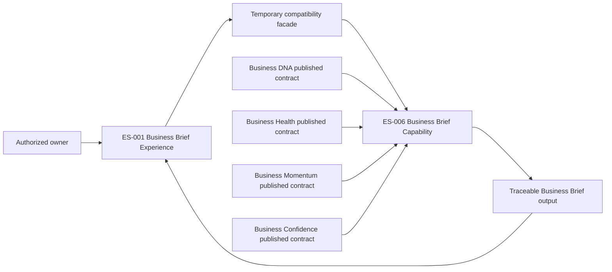

# ES-007 — Business Brief Migration

| Attribute | Value |
|---|---|
| Version | 1.0 |
| Status | Approved |
| Owner | Technical Architecture |
| Approving Authority | Founder |
| Migration Source | ES-001 — Business Brief Experience v1.0 |
| Migration Target | ES-006 — Business Brief Capability v1.0 |
| Canonical Authority | KP-005 — Business Brief v1.0 |
| Architecture Standard | Platform Capability Architecture Standard v1.0 |

## 1. Purpose

This Engineering Specification defines the controlled migration of the existing ES-001 Business Brief application boundary to the ES-006 Business Brief Capability architecture.

The migration preserves ES-001 as the approved Business Brief Experience boundary. ES-006 becomes the canonical capability beneath that experience. The migration must preserve KP-005, source-capability ownership, traceability, deterministic grounding, explicit limitations, owner control, and the approved Business Brief experience.

This specification authorizes no implementation. It defines the migration design and approval gates required before BRIEF-001 or any migration package begins.

## 2. Approved Architectural Decisions

1. ES-006 extends ES-001; it does not replace ES-001 immediately.
2. ES-001 remains the Business Brief Experience boundary.
3. ES-006 is the canonical Business Brief Capability beneath the experience layer.
4. The migration shall use a strangler strategy with a temporary compatibility facade.
5. No duplicate permanent Business Brief implementations are permitted.
6. Business DNA, Business Health, Business Momentum, and Business Confidence shall retain their existing canonical ownership and shall be consumed through owner-published contracts only.
7. No founder-unapproved materiality, relevance, ranking, selection, recommendation, or narrative policy may be introduced during this migration.

## 3. Scope

This proposal covers:

- model migration and mapping;
- contract migration and mapping;
- service-boundary migration;
- temporary compatibility-facade responsibilities;
- characterization, compatibility, rollback, deprecation, and final-removal requirements; and
- the approval gates for future implementation packages.

This proposal does not define implementation code, persistence, APIs, event transport, UI changes, AI orchestration, a Policy Engine, scoring, ranking, materiality rules, relevance rules, or a new canonical Business Brief meaning.

## 4. Baseline and Target Architecture

### 4.1 ES-001 Baseline

The existing ES-001 boundary is an approved application boundary that:

- accepts an owner request for a business and point in time;
- performs authorization;
- retrieves generic Business Health, Momentum, and Confidence snapshots;
- retrieves aggregated business context and material items;
- assembles a generic point-in-time narrative; and
- optionally records retrieval through an audit contract.

Its public boundary is represented by `BusinessBriefService.get_brief` and its associated request, context, signal, material-item, and audit contracts.

### 4.2 ES-006 Target

The ES-006 capability shall:

- own traceable narrative integration only;
- consume source-owner contracts, projections, or stable read models;
- preserve source ownership, source references, deterministic evidence, approved context, temporal context, and limitations;
- provide structured explanation of material narrative content and recommendations;
- remain distinct from every integrated canonical capability; and
- prohibit unapproved materiality, relevance, ranking, selection, scoring, and narrative-policy behavior.

### 4.3 Target Relationship

The compatibility facade is temporary. It preserves the ES-001 experience-facing contract while the ES-006 capability becomes the only canonical narrative-integration implementation.

## 5. Complete Model Mapping

| ES-001 Model | ES-006 Target Role | Migration Treatment | Required Preservation |
|---|---|---|---|
| `SignalKind` | Source-capability identity in a traceable source reference. | Retire as the generic canonical-signal type. Map only to the corresponding owner-published capability contract. | Health, Momentum, and Confidence remain separately owned. |
| `BriefItemKind` | Source category for approved activity, priority, opportunity, or risk input. | Replace only when an owner-published contract and canonical definition exist. | Category, source owner, time context, and limitations. |
| `EvidenceReference` | Deterministic evidence reference or approved-context reference. | Split by meaning; evidence and approved context must be distinguishable. | Source owner, reference, description, and applicable time. |
| `NarrativeStatement` | Traceable material narrative statement. | Replace with a structure that requires an authoritative basis. | Statement, source references, deterministic evidence, approved context, and limitations. |
| `CanonicalSignal` | Source-specific authoritative output consumed through its owner’s contract. | Remove from the target capability model. The Brief shall reference, not wrap or recalculate, source assessments. | Source assessment identity, assessment time, evidence, provenance, and limitations. |
| `BriefItem` | Traceable approved input or material narrative item. | Replace only after its canonical owner contract is available. | Source ownership, evidence, context, limitation, and any owner-approval requirement. |
| `BusinessBriefContext` | Individually attributable approved Business DNA, Business Season, Business Goals, and current understanding inputs. | Decompose; do not retain one opaque aggregate context as the target canonical model. | Owner, reference, effective time, and limitations for each context element. |
| `BusinessBriefRequest` | ES-001 experience request and compatibility-facade input. | Retain temporarily outside the ES-006 canonical output model. | Authorized business, requesting actor, and requested point in time. |
| `BriefNarrative` | ES-006 structured point-in-time narrative integration. | Replace; the target shall not require generic signal wrappers or silently assume all inputs are available. | Material source references, evidence, approved context, source meaning, and limitations. |
| `BusinessBrief` | ES-006 authoritative point-in-time Business Brief output. | Replace behind the compatibility facade. | Business identity, brief time, material narrative content, source traceability, limitations, and structured explanation basis. |

### 5.1 Access and Audit Separation

`requested_by` is required for ES-001 authorization and retrieval audit. It is not canonical Business Brief business meaning. The target capability output shall not use actor identity to redefine the Brief. The compatibility facade and approved audit boundary shall preserve actor context separately from the canonical narrative output.

### 5.2 Recommendation Mapping

ES-001 represents owner control through `requires_owner_approval` on a generic material item. ES-006 requires a recommendation, when presented, to retain understandable reasoning and authoritative traceability.

The migration shall not generate, rank, select, or introduce recommendations. It may preserve an already approved recommendation structure only when its source owner, reasoning, evidence, context, limitations, and owner-control requirement are available.

## 6. Complete Contract Mapping

| ES-001 Contract | ES-006 Target Boundary | Migration Treatment |
|---|---|---|
| `BusinessBriefAuthorization` | Authorization contract at the ES-001 experience facade or approved application boundary. | Retain. It remains responsible only for access to the requested business context. |
| `BusinessBriefContextProvider` | Owner-published Business DNA read provider; future Business Season and Business Goals providers. | Decompose. The Brief must not consume a permanent opaque aggregate context. |
| `BusinessHealthReader` | Business Health owner-published read provider. | Replace local generic reader with the owner contract or a stable owner-published read model. |
| `BusinessMomentumReader` | Business Momentum owner-published read provider. | Replace local generic reader with the owner contract or a stable owner-published read model. |
| `BusinessConfidenceReader` | Business Confidence owner-published read provider. | Replace local generic reader with the owner contract or a stable owner-published read model. |
| `BusinessBriefMaterialReader` | Future owner-published providers for activity, priorities, opportunities, and risks. | Retire the generic aggregate reader incrementally. No replacement is permitted until each input has canonical ownership and a published contract. |
| `BusinessBriefAuditRepository` | Capability-prefixed audit contract, where approved access audit is required. | Retain as a controlled cross-cutting side effect. It must record retrieval context without becoming persistence logic in the capability service. |
| No ES-001 equivalent | ES-006 Brief read provider. | Add only after the canonical capability output exists and approved consumers require it. |
| No ES-001 equivalent | ES-006 Brief traceability or explanation provider. | Add only after the structured explanation boundary is approved and implemented. |

All target contracts shall be technology-agnostic. No target contract may access source-domain persistence, invoke another capability’s service internals, recreate a source assessment, or hide source limitations.

## 7. Service Migration

### 7.1 Existing Service Role

The existing `BusinessBriefService` shall be treated as the ES-001 experience-facing legacy boundary during migration. Its request authorization, business-context isolation, and retrieval-audit behavior remain valid experience concerns.

### 7.2 Target Capability Service Role

The ES-006 deterministic service shall assemble and validate only authoritative, point-in-time Business Brief structures supplied through owner-published contracts. It shall:

- preserve source identity, evidence, approved context, time context, and limitations;
- reject structurally inconsistent or untraceable input;
- preserve independent source ownership; and
- remain deterministic for identical authoritative input.

It shall not generate narrative text, generate recommendations, select material items, determine relevance, rank inputs, calculate source assessments, call AI, access persistence, expose APIs, or implement policy.

### 7.3 Compatibility Facade

The temporary compatibility facade shall:

- retain the ES-001 experience request contract while consumers migrate;
- perform authorization before exposing a Brief;
- obtain ES-006 output through its published capability boundary;
- map ES-006 output to the legacy experience response only without loss of source meaning, traceability, temporal context, or limitations;
- record access through the approved audit boundary where required; and
- prohibit new consumers from depending on legacy generic signal or context types.

The facade shall not calculate canonical signals, compose AI narrative, infer missing inputs, rank material items, conceal limitations, or execute a consequential action.

## 8. Migration Phases

### Phase 0 — Governance and Baseline

1. Update ES-006 metadata to reflect Founder approval.
2. Approve ES-007 before code changes.
3. Freeze the existing ES-001 boundary behavior with characterization tests.
4. Confirm the published read contracts of Business DNA, Business Health, Business Momentum, and Business Confidence.
5. Record that no narrative materiality, relevance, ranking, selection, or generation policy is authorized.

### Phase 1 — ES-006 Canonical Structures

1. Introduce ES-006 immutable models in a non-conflicting migration namespace.
2. Implement only structures that preserve authoritative inputs; do not replace the legacy `BusinessBrief` model in place.
3. Validate business identity, brief time, source ownership, source references, deterministic evidence, approved context, limitations, and temporal consistency.
4. Add focused model characterization and invariant tests.
5. Keep ES-001 service and contracts unchanged.

**Approval gate:** Founder approval is required before Phase 2.

### Phase 2 — Contract and Capability Assembly Migration

1. Introduce ES-006 technology-agnostic contracts that consume source-owner published contracts only.
2. Implement the deterministic ES-006 assembly service without policy or generation behavior.
3. Introduce the compatibility facade as a one-way translation from ES-001 experience request semantics to ES-006 output.
4. Verify no source assessment is reduced to an untraceable generic signal for new consumers.
5. Retain the existing ES-001 path as rollback capability.

**Approval gate:** Founder approval is required before Phase 3.

### Phase 3 — Explanation and Experience Cutover

1. Implement structured explanation preservation only after its specification and package scope are approved.
2. Route the ES-001 experience boundary to the ES-006 capability through the compatibility facade.
3. Verify ES-001 user-journey, authorization, audit, owner-control, source-separation, and limitation requirements against ES-006 output.
4. Prohibit new direct dependencies on legacy generic models and local reader protocols.

**Approval gate:** Founder approval is required before deprecation begins.

### Phase 4 — Deprecation and Final Removal

1. Mark legacy generic models and local reader protocols as compatibility-only.
2. Migrate every approved consumer to ES-006 output and explanation contracts.
3. Remove the compatibility facade and legacy structures only after the final-removal criteria are satisfied.
4. Record final completion through approved governance and capability milestones.

## 9. Migration Success Criteria

The migration is complete only when all of the following conditions are true:

1. ES-006 is the sole canonical Business Brief capability implementation.
2. ES-001 remains the approved experience boundary and consumes ES-006 output without changing canonical source meaning.
3. Every material Brief statement and recommendation preserves the required source owner, source reference, business and point-in-time context, deterministic evidence, approved context, and explicit limitations.
4. Business DNA, Business Health, Business Momentum, and Business Confidence continue to be consumed only through their owner-published contracts, projections, or stable read models.
5. No production consumer depends on the legacy generic `CanonicalSignal`, aggregated `BusinessBriefContext`, local source-reader contracts, or temporary compatibility facade.
6. The compatibility facade has been removed, the legacy ES-001 generic implementation has been removed, and no duplicate permanent Business Brief implementation remains.
7. Characterization, contract, traceability, authorization, audit, rollback, linting, typing, and applicable capability tests pass.
8. No unapproved materiality, relevance, ranking, selection, recommendation, or narrative policy has been introduced.
9. Founder approval authorizes final legacy removal and records Business Brief migration completion.

## 10. Characterization Tests

Before Phase 1, the legacy boundary shall be characterized for the following approved ES-001 behavior:

- authorized retrieval returns a Brief for the requested business and point in time;
- unauthorized retrieval is denied;
- a Health, Momentum, or Confidence source cannot be substituted for another signal role;
- source signal identity and available evidence remain visible;
- Business DNA context remains associated with the requested business;
- material-item owner-approval requirements are preserved;
- retrieval audit behavior remains controlled and observable when configured; and
- the service does not calculate canonical source assessments or execute an action.

Additional migration characterization tests shall prove:

- the ES-006 output preserves all source identity and limitation information required by the legacy result;
- the facade does not drop source time, provenance, evidence, approved context, or limitations;
- legacy and ES-006 results are semantically equivalent where both can represent the same approved input; and
- unavailable or not-yet-canonical priority, opportunity, and risk inputs are explicit rather than inferred.

## 11. Compatibility Strategy

1. The ES-001 public experience request remains stable during migration.
2. ES-006 becomes the sole target canonical capability implementation.
3. The compatibility facade is one-way: legacy experience semantics may be adapted to ES-006, but new consumers shall not be built on generic ES-001 models.
4. Source capabilities remain independently owned and are consumed only through their published contracts.
5. No lossy mapping is permitted. If ES-001 cannot represent required ES-006 traceability or limitations, the experience contract must be evolved through Founder-approved migration scope rather than discarding information.

## 12. Rollback Strategy

No persistent data migration is in scope for this proposal. Rollback is therefore boundary routing only.

Until Phase 4 completion:

- the existing ES-001 service path shall remain available;
- the compatibility facade shall be removable without altering source capabilities;
- the ES-006 capability shall not write or mutate source-domain data;
- rollback shall route the experience boundary back to the characterized ES-001 behavior; and
- rollback shall preserve authorization, business isolation, and retrieval-audit obligations.

Rollback must not restore legacy behavior by recalculating, redefining, or mutating Business DNA, Health, Momentum, or Confidence.

## 13. Deprecation Criteria

Legacy ES-001 generic models and local reader contracts may be marked deprecated only when:

1. ES-006 models, contracts, deterministic service, and required structured explanation boundary are approved and implemented.
2. The ES-001 experience consumes ES-006 output through the compatibility facade.
3. Every material source input retains owner, reference, evidence, context, temporal context, and limitation traceability.
4. All approved consumers of the legacy boundary have a documented migration path.
5. Regression, contract, traceability, authorization, and rollback tests pass.
6. Founder approval authorizes deprecation.

## 14. Final Removal Criteria

The legacy ES-001 generic implementation may be removed only when:

1. No production consumer imports or depends on legacy generic Brief models, local source readers, or the compatibility facade.
2. The ES-006 capability is the sole canonical Business Brief implementation.
3. The ES-001 experience uses ES-006 output and explanation contracts without loss of approved behavior.
4. Source ownership remains unchanged for Business DNA, Health, Momentum, and Confidence.
5. All required tests, linting, and typing checks pass.
6. Founder approval authorizes final removal.

## 15. Affected Packages

### Direct Migration Scope

- `backend/app/modules/business_brief/models.py`
- `backend/app/modules/business_brief/service.py`
- `backend/app/modules/business_brief/ports.py`
- `backend/app/modules/business_brief/exceptions.py`
- `backend/app/modules/business_brief/__init__.py`
- `backend/tests/test_business_brief_service.py`
- Future `BRIEF-001` through `BRIEF-005` packages

### Consumed Ownership Boundaries

- Business DNA published read contracts
- Business Health published read contracts
- Business Momentum published read contracts
- Business Confidence published read contracts
- Authorization and audit contracts
- Future owner-published Business Season, Business Goals, priorities, opportunities, and risks contracts

The source capabilities are dependencies, not migration targets. Their canonical models, services, policies, explanations, and ownership shall not change as part of this migration.

## 16. Risks and Controls

| Risk | Required Control |
|---|---|
| Two permanent Brief implementations emerge. | Enforce one canonical ES-006 capability and time-bounded legacy facade only. |
| Generic legacy signals reduce source traceability. | Replace generic signal consumption with source-owner contracts; prohibit lossy mappings. |
| Migration introduces hidden relevance or ranking rules. | Defer all materiality, relevance, ranking, selection, and narrative policy pending Founder approval. |
| Experience behavior regresses. | Characterize ES-001 behavior before migration and maintain rollback routing. |
| Source ownership transfers to Brief. | Preserve source contracts and prohibit source-domain persistence access or source assessment recalculation. |
| Limitations are lost at the facade. | Treat limitations as required traceable structures in every mapping and contract test. |

## 17. Governance

After Phase 0, no new Business Brief functionality may be implemented directly in the legacy ES-001 implementation. All future Business Brief capability development shall target ES-006. ES-001 shall act only as the approved experience boundary and, during migration, as the temporary compatibility-facade boundary until retirement.

This Engineering Specification is subordinate to KP-005 — Business Brief v1.0, ES-001 — Business Brief Experience v1.0, ES-006 — Business Brief Capability v1.0, the Blueprint authority hierarchy, and Platform Capability Architecture Standard v1.0.

No production-code migration, BRIEF-001 implementation, compatibility facade, model replacement, or legacy deprecation may begin except as authorized by the approved phased migration plan and applicable Founder package approval. Any change to source-capability ownership, canonical Business Brief meaning, or unapproved policy requires the applicable Blueprint governance process.

## Version History

| Version | Status | Change |
|---|---|---|
| 1.0 | Approved | Founder approval; reclassified as ES-007 and approved with migration success and legacy-development governance refinements. |
