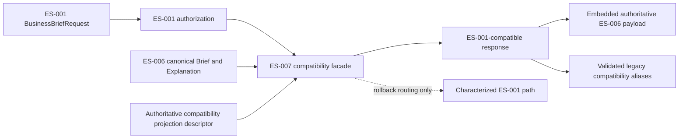
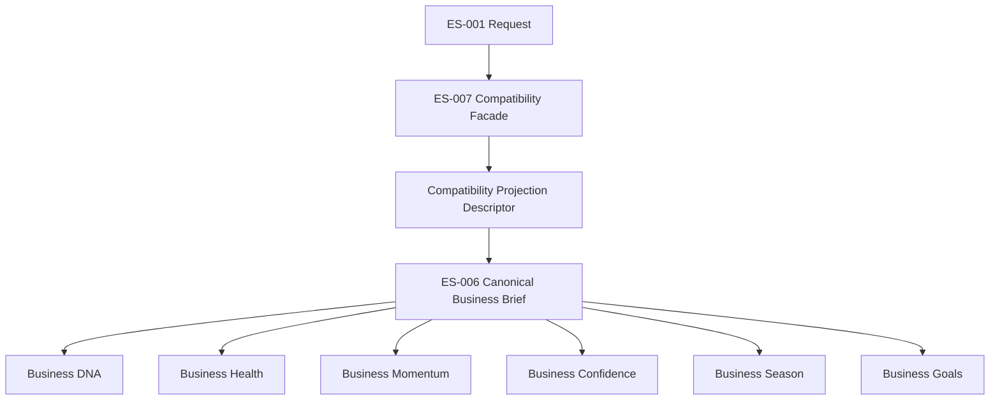

# ES-007A — Business Brief Compatibility Projection Specification

| Attribute | Value |
|---|---|
| Version | 1.0 |
| Status | Approved |
| Owner | Technical Architecture |
| Approving Authority | Founder |
| Parent Authority | ES-007 — Business Brief Migration v1.0 |
| Source Boundary | ES-001 — Business Brief Experience v1.0 |
| Canonical Target | ES-006 — Business Brief Capability v1.0 |
| Canonical Business Authority | KP-005 — Business Brief v1.0 |
| Architecture Standard | Platform Capability Architecture Standard v1.0 |

## 1. Purpose

This Engineering Specification defines the deterministic, lossless compatibility projection required to expose an ES-006 canonical Business Brief through the temporary ES-001 experience boundary during the ES-007 migration.

It resolves the incompatibility between ES-001's legacy response structures and ES-006's authoritative traceability, source-ownership, temporal-context, and limitation structures. It does not redefine Business Brief or any source capability.

## 2. Scope

This specification defines only:

- the authoritative payload carried through the ES-001 response boundary;
- the meaning and limits of legacy compatibility aliases;
- the deterministic validation required before a legacy alias is exposed;
- authorization, isolation, audit, rollback, and deprecation requirements for the projection boundary; and
- the implementation acceptance criteria for the ES-007 compatibility facade.

This specification does not define narrative composition, recommendation generation, materiality, relevance, prioritization, ranking, filtering, ordering, conflict resolution, policy, AI behavior, persistence, APIs, or user-interface behavior.

## 3. Approved Projection Decision

**Decision: B — embed the canonical ES-006 Business Brief inside the ES-001 response as the authoritative payload while retaining ES-001 fields as compatibility aliases.**

ES-001 response models SHALL evolve additively only as necessary to carry the canonical payload and its structured explanation. Existing ES-001 fields SHALL remain available to existing consumers during migration, but SHALL be explicitly non-authoritative compatibility aliases.

The embedded ES-006 Business Brief and its structured explanation SHALL be the sole authoritative representation delivered by the compatibility facade. A legacy alias SHALL never replace, reduce, or become an alternative authority for the embedded canonical payload.

This decision is required because the existing ES-001 structures cannot independently preserve all ES-006 source ownership, provenance, temporal context, approved context, evidence, and limitation information.

## 4. Canonical Definitions

| Term | Definition |
|---|---|
| Canonical payload | The immutable ES-006 `BusinessBrief` and its corresponding `BusinessBriefExplanation`, preserved exactly as received from the canonical capability boundary. |
| Compatibility facade | The temporary ES-007 application-layer boundary that authorizes an ES-001 request, obtains canonical output, validates a projection, and returns an ES-001-compatible response. |
| Compatibility alias | A legacy ES-001 field that exposes a supplied, validated view of an identified structure already contained in the canonical payload. It is not an independent source of truth. |
| Compatibility projection descriptor | An immutable, authoritative, point-in-time declaration that identifies which existing canonical structures correspond to named ES-001 alias fields. It contains no generated business content and makes no selection, ranking, or relevance decision. |
| Lossless projection | A response in which the embedded canonical payload retains every authoritative source reference, deterministic evidence item, approved-context item, provenance element, temporal value, and explicit limitation supplied by ES-006. |
| Projection unavailable | A deterministic outcome in which a requested alias cannot be validated from supplied authoritative structures. It is not a substitute Brief, inferred default, or silent fallback. |

## 5. Projection Descriptor Ownership

The Compatibility Projection Descriptor is owned exclusively by the ES-007 migration boundary. It is a temporary migration structure and is not part of the canonical ES-006 Business Brief capability, its domain models, its service, its contracts, or its explanation engine.

The descriptor SHALL identify existing canonical structures only. It SHALL NOT extend, redefine, or become a source of canonical ES-006 Business Brief meaning.

## 6. Projection Boundary



### Dependency Direction



Dependencies point from the ES-001 request through the ES-007 migration boundary toward the canonical ES-006 Brief and then to its owner-published source capabilities. No dependency or data flow is permitted from an ES-001 compatibility structure back into ES-006.

The facade SHALL access ES-006 only through its published capability contracts, projections, or stable read models. It SHALL NOT invoke source-capability internals or directly access source-domain persistence.

## 7. Required Response Evolution

The ES-001 `BusinessBrief` response SHALL retain its existing fields for compatibility and SHALL add the following immutable fields:

| Additive field | Required value |
|---|---|
| `canonical_brief` | The authoritative ES-006 `BusinessBrief`, preserved without transformation. |
| `canonical_explanation` | The authoritative ES-006 `BusinessBriefExplanation`, preserved without transformation. |
| `projection_status` | `available` only when every exposed alias validates against the embedded canonical payload; otherwise `unavailable`. |
| `projection_limitations` | Explicit limitations supplied by the canonical payload and any deterministic statement that a requested alias is unavailable. |

The response SHALL preserve `business_id`, `requested_by`, and `as_of` from the authorized ES-001 request context. `requested_by` remains access and audit context only; it is not canonical Business Brief meaning.

The response SHALL NOT omit or transform the canonical payload to fit a legacy alias. Where a legacy field cannot represent canonical information, consumers SHALL use the embedded payload.

## 8. Authoritative Inputs

The compatibility facade SHALL consume only:

1. an ES-001 `BusinessBriefRequest`;
2. the ES-001 authorization result for that request;
3. one authoritative ES-006 `BusinessBrief` for the same business and point in time;
4. its authoritative ES-006 `BusinessBriefExplanation`; and
5. one authoritative compatibility projection descriptor for that same canonical payload.

The descriptor SHALL identify canonical structures by direct immutable structural reference. It SHALL NOT contain replacement statement text, generated recommendations, transformed evidence, inferred context, derived limitations, or substitute source assessments.

If the descriptor, canonical Brief, canonical explanation, request business, or request time does not match, the facade SHALL reject the canonical projection and SHALL NOT expose a mixed-business or mixed-time result.

## 9. Deterministic Projection Rules

### 9.1 General Rules

1. The facade SHALL authorize the ES-001 request before retrieving or exposing a canonical payload.
2. The facade SHALL preserve the canonical Brief and explanation exactly as received.
3. The facade SHALL preserve tuple membership and supplied order exactly. It SHALL NOT reorder, filter, rank, prioritize, summarize, merge, or select content.
4. The facade SHALL validate each requested alias solely against the explicit compatibility projection descriptor and the embedded canonical payload.
5. The facade SHALL reject an alias when the descriptor does not identify an exact canonical structure or when the identified structure fails traceability, ownership, business, temporal, or limitation validation.
6. The facade SHALL NOT create a default alias, choose another candidate, or infer a missing value.
7. All authoritative information remains available through `canonical_brief` and `canonical_explanation` even when one or more legacy aliases are unavailable.

### 9.2 Alias Descriptor Rules

A descriptor MAY identify an alias only by directly referencing a structure already present in the canonical Brief or explanation. It SHALL preserve the referenced structure unchanged.

| ES-001 alias | Allowed descriptor reference | Validation requirement |
|---|---|---|
| `context.current_understanding` | One explicit canonical `BusinessBriefNarrativeItem`. | The exact item MUST be present in `canonical_brief.narrative_items`. |
| `context.business_dna`, `context.business_season`, `context.business_goals` | One or more explicit canonical source references or approved-context references. | Every reference MUST be present in the embedded canonical item's traceability and retain its owner, effective time, and limitations in the canonical payload. |
| `narrative.health` | One explicit canonical narrative item and one explicit source reference of kind `business_health`. | Both structures MUST be present in the canonical payload; the source reference MUST retain the Health owner and effective time. |
| `narrative.momentum` | One explicit canonical narrative item and one explicit source reference of kind `business_momentum`. | Both structures MUST be present in the canonical payload; the source reference MUST retain the Momentum owner and effective time. |
| `narrative.confidence` | One explicit canonical narrative item and one explicit source reference of kind `business_confidence`. | Both structures MUST be present in the canonical payload; the source reference MUST retain the Confidence owner and effective time. |
| `narrative.material_items` | Explicit canonical narrative items or recommendations with an explicit source reference of the corresponding activity, priority, opportunity, or risk kind. | Each item MUST be individually identified. An owner-approval requirement MUST be supplied by its authoritative owner and traceable in the canonical payload; otherwise that legacy material alias is unavailable. |

An alias descriptor does not select content. It declares an already approved correspondence. The facade validates that correspondence; it does not determine it.

### 9.3 Legacy Alias Construction

When an alias validates, the facade MAY construct the legacy ES-001 wrapper using only the directly referenced canonical structure:

- `NarrativeStatement.text` SHALL equal the supplied canonical statement exactly.
- `NarrativeStatement.evidence` SHALL be a direct compatibility representation of the referenced canonical source references, deterministic evidence, and approved context. The authoritative ownership, effective time, observation time, provenance, and limitations SHALL remain available without loss in the embedded canonical payload.
- `NarrativeStatement.limitations` SHALL preserve the referenced canonical limitations exactly; it SHALL NOT deduplicate, suppress, or replace them.
- `CanonicalSignal.assessed_at` SHALL equal the explicitly referenced canonical source effective time. The alias SHALL retain the matching legacy signal kind only as a compatibility label.
- `BriefItem.kind` and `requires_owner_approval` SHALL be exposed only when both values are explicitly supported by the authoritative canonical structures and the descriptor. `requires_owner_approval` SHALL never default to `false`.

The embedded ES-006 payload, not the legacy wrapper, remains the authoritative source for all traceability fields that ES-001 cannot represent.

### 9.4 Projection Unavailability

The projection status SHALL be `unavailable` if any required alias is absent, ambiguous, untraceable, from another business, from after the requested point in time, or lacks an authoritative owner-approval requirement where ES-001 requires one.

On unavailability, the facade SHALL:

- retain the complete embedded canonical payload and its explicit limitations when authorization permits;
- identify the unavailable alias through an explicit deterministic limitation;
- avoid all substitutes, defaults, inferred aliases, and partial alias replacement; and
- preserve the characterized ES-001 route as rollback capability.

## 10. Traceability, Temporal Context, and Limitations

The facade SHALL preserve the following without modification inside the embedded canonical payload and explanation:

- narrative items and recommendations;
- source references and source owners;
- deterministic evidence and evidence provenance;
- approved context;
- source effective time, evidence observation time, and Brief point-in-time context; and
- explicit limitations at every supplied level.

The facade SHALL validate that the canonical Brief business identity equals the authorized request business and that every canonical source, evidence, and context element is valid at or before `as_of`. It SHALL reject mismatches rather than cross business boundaries or conceal unavailable information.

## 11. Authorization, Audit, and Business Isolation

Authorization SHALL occur before canonical retrieval or response construction. The facade SHALL use the retained ES-001 authorization boundary for the requested business and requesting actor.

The facade SHALL ensure that:

- the request business, canonical Brief business, canonical explanation business, and every descriptor reference identify the same business;
- the request `as_of`, canonical Brief time, explanation time, and descriptor time identify the same point in time or a documented, non-future compatible point in time; and
- no alias, source reference, evidence, context, or limitation from another business is exposed.

Where ES-001 retrieval auditing is configured, the facade SHALL record the authorized request context and the canonical Brief identity. Audit behavior SHALL remain a controlled side effect and SHALL NOT alter the canonical payload or aliases.

## 12. Rollback, Compatibility, and One-Way Direction

The original characterized ES-001 service route SHALL remain available until ES-007 deprecation criteria are satisfied and Founder approval authorizes retirement.

The compatibility facade is temporary. It SHALL be removed only after Founder-approved completion of ES-007 Phase 3 and retirement of ES-001 under ES-007 final-removal criteria. Its removal SHALL not alter canonical ES-006 Business Brief meaning or source-capability ownership.

The projection is strictly one-way:

```text
ES-006 Canonical Business Brief ? ES-001 Compatibility Response
```

No ES-001 compatibility structure, alias, request, context, signal, material item, or response MAY be converted back into canonical ES-006 Business Brief structures. The facade SHALL NOT reconstruct, infer, or update canonical output from legacy compatibility data.

Rollback SHALL change routing only. It SHALL NOT mutate, reinterpret, recalculate, or replace canonical ES-006 output or any source capability output.

No new consumer SHALL depend on legacy compatibility aliases. New consumers SHALL use ES-006 published output and explanation contracts.

## 13. Prohibited Behavior

The compatibility facade, projection descriptor, aliases, and tests SHALL NOT:

- create or compose narrative text;
- generate, select, evaluate, filter, rank, prioritize, or recommend content;
- resolve conflicts between canonical inputs;
- calculate or redefine Business DNA, Business Health, Business Momentum, Business Confidence, Business Season, Business Goals, priorities, opportunities, or risks;
- call AI or use AI-generated content as authoritative input;
- access repositories, persistence, APIs, adapters, or source capability internals except through approved contracts; or
- execute or authorize a consequential business action.

## 14. Acceptance Criteria

| ID | Criterion |
|---|---|
| PROJ-AC-001 | An authorized ES-001 request receives an ES-001-compatible response containing the exact authoritative ES-006 Brief and explanation. |
| PROJ-AC-002 | Every exposed alias is explicitly declared, validates against the embedded canonical payload, and is identified as non-authoritative compatibility output. |
| PROJ-AC-003 | The response preserves every authoritative narrative item, recommendation, source reference, deterministic evidence item, approved-context item, provenance value, time value, and limitation in the embedded payload. |
| PROJ-AC-004 | A missing, ambiguous, invalid, cross-business, future, or untraceable alias is unavailable; the facade does not select an alternative or infer a replacement. |
| PROJ-AC-005 | Existing ES-001 request authorization, business isolation, and retrieval-audit behavior remain observable to legacy consumers. |
| PROJ-AC-006 | The original ES-001 route remains available as rollback routing until Founder-approved deprecation. |
| PROJ-AC-007 | No new consumer depends on an ES-001 generic signal, context, or material-item alias. |
| PROJ-AC-008 | The implementation contains no policy, AI, ranking, selection, summarization, generation, persistence, API, or source-assessment behavior. |

## 15. Testing Requirements

Implementation tests SHALL verify:

- ES-001 request semantics, authorization denial, and audit behavior remain characterized;
- exact embedding of canonical Brief and explanation structures;
- direct identity preservation for narrative items, recommendations, source references, evidence, approved context, temporal context, and limitations;
- descriptor membership validation for every exposed alias;
- rejection of missing, ambiguous, future, cross-business, and untraceable alias structures;
- projection-unavailable behavior without fallback defaults or inferred aliases;
- rollback routing to the characterized ES-001 boundary; and
- the absence of policy, selection, ranking, generation, AI, repository, persistence, API, and infrastructure behavior within the facade.

## 16. Dependencies

| Dependency | Role |
|---|---|
| ES-007 — Business Brief Migration v1.0 | Migration strategy, phases, rollback, deprecation, and final-removal authority. |
| ES-001 — Business Brief Experience v1.0 | Legacy request, authorization, audit, and experience-boundary compatibility. |
| ES-006 — Business Brief Capability v1.0 | Canonical Business Brief, contracts, deterministic service, and explanation authority. |
| KP-005 — Business Brief v1.0 | Canonical Business Brief definition and boundaries. |
| Platform Capability Architecture Standard v1.0 | Dependency direction, contract, testing, lifecycle, and milestone requirements. |
| TaxPilot Architecture Constitution v1.0 | Authority, traceability, auditability, and business-isolation principles. |

## 17. Compatibility Facade Lifecycle

This projection is temporary. It SHALL be retired when ES-001 consumers no longer require legacy aliases and ES-007 final-removal criteria are satisfied.

Any addition of a legacy alias, change to alias mapping, or change to projection availability semantics requires Founder approval. Such a change SHALL NOT modify canonical ES-006 Business Brief meaning or introduce unapproved policy.

## 18. Governance

This specification is subordinate to KP-005, ES-001, ES-006, ES-007, the TaxPilot Architecture Constitution, and the Platform Capability Architecture Standard.

No compatibility-facade implementation may begin until this specification is founder-approved. Any conflict between an alias requirement and lossless canonical preservation SHALL be resolved in favor of the embedded canonical payload; the alias SHALL be unavailable until Founder approves a revised projection rule.

## 19. Version History

| Version | Status | Change |
|---|---|---|
| 1.0 | Approved | Founder approval; clarified temporary lifecycle, one-way projection, descriptor ownership, and dependency direction. |